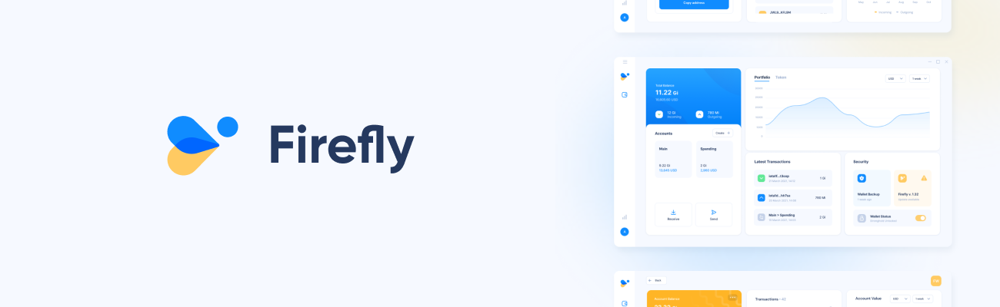

<h1 align="center">
   
  
</h1>

<h2 align="center">Firefly IOTA</h2>

  
  

  
  
  

  <a href="#about">About</a> ◈
  <a href="#installation">Installation</a> ◈
  <a href="#getting-started">Contributing</a> ◈
  <a href="#joining-the-discussion">Joining the discussion</a> 

---

## About

Firefly is the official wallet for managing your tokens and assets on the Shimmer network.

## Installation

There are a few options to install Firefly:

-   Download from [official Firefly website](https://firefly.iota.org)
-   Download from the latest [GitHub release](https://github.com/iotaledger/firefly/releases/tag/desktop-2.0.0)
-   Build from source code (see our handbook guide for ["Environment Setup"](https://iotaledger.github.io/firefly/guides/environment-setup/))

## Contributing

Help out the Firefly project by filing a [bug report](https://github.com/iotaledger/firefly/issues/new?assignees=&labels=bug&template=bug_report.yml), making a [feature request](https://github.com/iotaledger/firefly/issues/new?assignees=&labels=feat&template=feature_request.md) or opening a [pull request](https://github.com/iotaledger/firefly/pulls/).
Checkout the [contribution guidelines](https://github.com/iotaledger/firefly/blob/develop/.github/CONTRIBUTING.md) before making a code contribution.

See our [development handbook](https://iotaledger.github.io/firefly/) for more details.

## Joining the discussion

If you have any questions for the developers or ideas you want to discuss, join the #firefly-discussion channel on our [Discord](https://discord.iota.org/).
