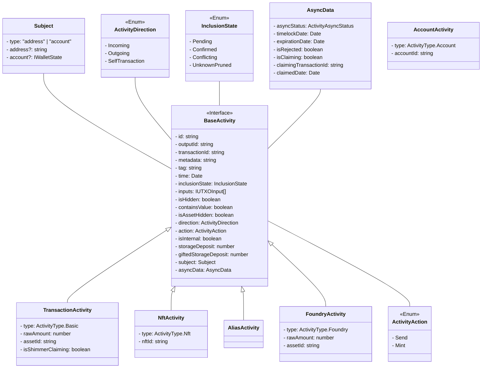

# Class Diagram

This document includes the class diagram of all activity types

```mermaid
classDiagram
    Subject -- Base Activity
    Activity Direction -- Base Activity
    Inclusion State -- Base Activity
    Async Data -- Base Activity
    Base Activity <|-- Transaction Activity
    Base Activity <|-- Nft Activity
    Base Activity <|-- Alias Activity
    Base Activity <|-- Foundry Activity
    Base Activity -- Activity Action
    class Base Activity {
        <<Interface>>
        - id: string
        - outputId: string
        - transactionId: string
        - metadata: string
        - tag: string
        - time: Date
        - inclusionState: InclusionState
        - inputs: IUTXOInput[]
        - isHidden: boolean
        - containsValue: boolean
        - isAssetHidden: boolean
        - direction: ActivityDirection
        - action: ActivityAction
        - isInternal: boolean
        - storageDeposit: number
        - giftedStorageDeposit: number
        - subject: Subject
        - asyncData: AsyncData
    }
    class Transaction Activity {
        - type: ActivityType.Basic
        - rawAmount: number
        - assetId: string
        - isShimmerClaiming: boolean
    }
    class Nft Activity {
        - type: ActivityType.Nft
        - nftId: string
    }
    class Foundry Activity {
        - type: ActivityType.Foundry
        - rawAmount: number
        - assetId: string
    }
    class Account Activity {
        - type: ActivityType.Account
        - accountId: string
    }
    class Subject {
        - type: "address" | "account"
        - address?: string
        - account?: IWalletState
    }
    class Activity Direction {
        <<Enum>>
        - Incoming
        - Outgoing
        - SelfTransaction
    }
    class Activity Action {
        <<Enum>>
        - Send
        - Mint
    }
    class Async Data {
        - asyncStatus: ActivityAsyncStatus
        - timelockDate: Date
        - expirationDate: Date
        - isRejected: boolean
        - isClaiming: boolean
        - claimingTransactionId: string
        - claimedDate: Date
    }
    class Inclusion State {
        <<Enum>>
        - Pending
        - Confirmed
        - Conflicting
        - UnknownPruned
    }
```
