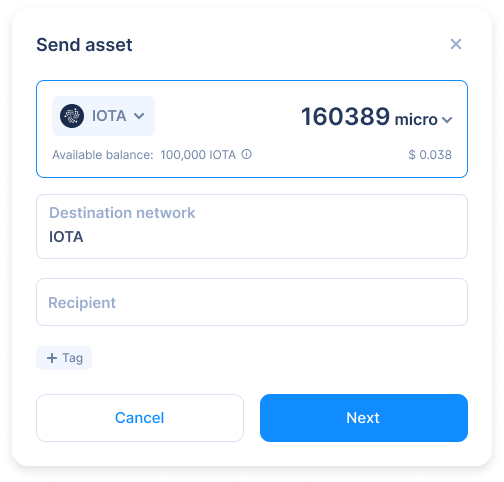
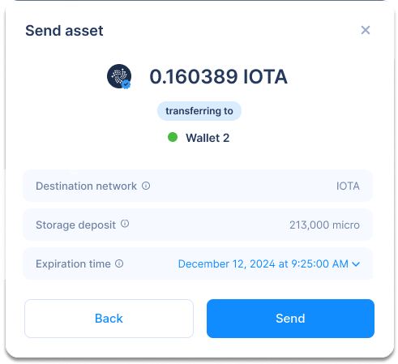
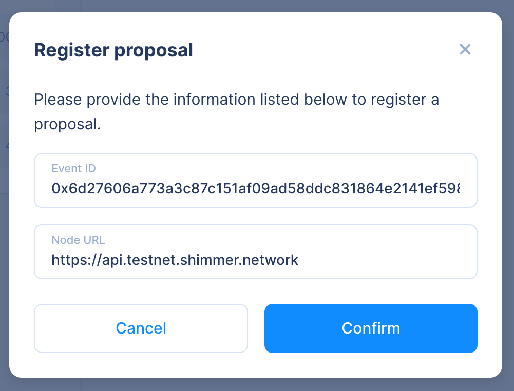

# Deep Links

Deep links are special URLs that, when navigated to, open
applications rather than a website in a browser.
They are useful for a number of things, however in our case
we are interested in the user experiences that they enable
between websites, applications, platforms, etc. by providing more interoperability.

Firefly has its own deep link scheme, exposing (limited) functionality that is required in 
some type of user flow. A trivial example would be a user is buying native tokens on Soonaverse and must make a payment transaction
in order to execute the buy order. Clicking on a deep link embedded inside the Soonaverse platform will trigger Firefly to 
open and auto-fill the transaction data as necessary, making it simple confirm and click job for the user. 

:::caution
Firefly **will NEVER** automatically execute actions initiated by a deep link; they should **ALWAYS** require manual 
confirmation on behalf of the user.
:::

## Scheme

The Firefly deep link scheme can be broken down to the following (simple) syntax:

```
firefly[-<stage>]://<context>/<operation>[?param=<param>]
```

The parameters are as follows:

- `stage` - indicates a specific stage of the app to target, options are:
  - `alpha` - the first available version of Firefly containing brand new features
  - `beta` - the next available version of Firefly containing new but slightly tested features
  - `shimmer` - the Firefly Shimmer version, containing new and well-tested features 
- `context` - the part of Firefly that contains the operation, options are:
  - `wallet` - managing coins and tokens
  - `collectibles` - managing NFTs
  - `governance` - managing voting events and proposals
- `operation` - an operation within a specific context (see below for more detail)
- `param` - query parameter(s) relevant for the specified operation

If you wish to target the production version, simply omit this from the prefix:

```
firefly://
```

:::caution
This deep link scheme is **NOT** compatible with Firefly V1, as that version of the application is in maintenance mode.
:::

## Contexts

### Wallet

#### Send Form

This operation brings the user to the send form popup:

:::image

:::

The deep link structure is as follows:

```
firefly://wallet/sendForm?address=<address>&amount=<amount>[&unit=<unit>][&assetId=<assetId>][&metadata=<metadata>][&tag=<tag>]
```

The following parameters are **required**:

- `address` - the recipient's address where the funds will be sent to
  - **MUST** be a Bech32 address; considering support for other address types in the future
- `amount` - the amount of tokens to send in the transaction
  - **MAY** contain a decimal so long as it makes sense given the value of the `unit` param (see below)

The following parameters are **optional**:

- `unit` - a specified denomination of the token to use, if applicable (default for IOTA is `Mi`, SMR is `SMR`)
- `assetId` - the identifier of the asset to send, e.g. `4218` (IOTA), `4219` (SMR), or a native token ID (default is base token of the network, i.e. IOTA or SMR)
- `metadata` - a string of text to embed as metadata in the transaction
- `tag` - a string to tag the transaction for indexing purposes

Example:

[!button Click me!](firefly://wallet/sendForm?address=iota1qrhacyfwlcnzkvzteumekfkrrwks98mpdm37cj4xx3drvmjvnep6xqgyzyx&amount=10&unit=Gi)

Source:

```
firefly://wallet/sendForm?address=iota1qrhacyfwlcnzkvzteumekfkrrwks98mpdm37cj4xx3drvmjvnep6xqgyzyx&amount=10&unit=Gi
```

#### Send Confirmation

This operation brings the user to the send confirmation popup:

:::image

:::

The deep link structure is as follows:

```
firefly://wallet/sendConfirmation?address=<address>&amount=<amount>[&unit=<unit>][&assetId=<assetId>][&metadata=<metadata>][&tag=<tag>][&giftStorageDeposit=<true|false>][&disableToggleGift=<true|false>][&disableChangeExpiration=<true|false>][&surplus=<surplus>]
```

The following parameters are **required**:

- `address` - the recipient's address where the funds will be sent to
  - **MUST** be a Bech32 address; considering support for other address types in the future
- `amount` - the amount of tokens to send in the transaction
  - **MAY** contain a decimal so long as it makes sense given the value of the `unit` param (see below)

The following parameters are **optional**:

- `unit` - a specified denomination of the token to use, if applicable (default for IOTA is `Mi`, SMR is `SMR`)
- `assetId` - the identifier of the asset to send, e.g. `4218` (IOTA), `4219` (SMR), or a native token ID (default is base token of the network, i.e. IOTA or SMR)
- `metadata` - a string of text to embed as metadata in the transaction
- `tag` - a string to tag the transaction for indexing purposes
- `giftStorageDeposit` - gifts the tokens used in funding the storage deposit for a transaction
- `disableToggleGift` - prevents the user from being able to toggle the option to gift the storage deposit
- `disableChangeExpiration` - prevents the user from being able to change the expiration time of the transaction
- `surplus` - send additional amounts of the base token when transferring native tokens

Example:

[!button Click me!](firefly://wallet/sendForm?address=iota1qrhacyfwlcnzkvzteumekfkrrwks98mpdm37cj4xx3drvmjvnep6xqgyzyx&amount=10&unit=Gi&giftStorageDeposit=true&surplus=1&metadata=Take%20my%20money)

Source:

```
firefly://wallet/sendConfirmation?address=iota1qrhacyfwlcnzkvzteumekfkrrwks98mpdm37cj4xx3drvmjvnep6xqgyzyx&amount=10&unit=Gi&giftStorageDeposit=true&disableToggleGift=true&surplus=1&metadata=Take%20my%20money
```

### Collectibles

Coming :soon:

### Governance

#### Register Proposal

This operation brings the user to the register proposal popup:

:::image

:::

The deep link structure is as follows:

```
firefly://governance/registerProposal?eventId=<eventId>[&nodeUrl=<nodeUrl>]
```

The following parameters are **required**:

- `eventId` - the event ID of the proposal's corresponding participation event in the network

The following parameter(s) are **optional**:

- `nodeUrl` - the specific node that is tracking the proposal's correspoding participation event

:::info
If your node requires authentication (e.g. username / password, JWT), it will require the user
to manually enter the information. 
:::

Example:

[!button Click me!](firefly://governance/registerProposal?eventId=TODO&nodeUrl=TODO)

Source:

```
firefly://governance/registerProposal?eventId=TODO&nodeUrl=TODO
```

#### Vote

Coming :soon:

<style>
  .image {
    margin: auto;
    max-width: 420px;
  }
</style>
