# Onboarding

Onboarding refers to the process of creating a new profile and sometimes configuring general application settings.

## Sections

This part of the app consists of different sub-sections:

- **App Setup**: Configuration of general application settings, e.g. language, appearance, agreeing to policies (if **NOT** completed onboarding before)
- **Network Setup**: Choosing the protocol, network, and possibly a custom node to be used by the profile
- **Profile Setup**: Selecting the method in which to create the profile (claim rewards, create new, or recover / restore),
  the secret manager to use, and lastly choosing a name
- **Profile Recovery**: Recovering or restoring a profile based on a mnemonic phrase, Stronghold backup, or Ledger device (claiming rewards  
  or recovering / restoring profiles **ONLY**)
- **Stronghold Setup**: Configuring the password for the Stronghold encryption (software profiles **ONLY**)
- **Storage Protection Setup**: Choosing and configuring the protection method for the profile's local data (currently only PIN, but biometric available for mobile)
- **Ledger Setup**: Verifying and / or establishing connection with the Ledger device
- **Profile Backup**: Backing up a mnemonic phrase on paper and / or exporting a Stronghold backup
- **Shimmer Claiming**: Finding and claiming Shimmer rewards

## Flowchart

```mermaid
graph TD;
    id0("Start")

    subgraph App Setup
    id1("Welcome")
    id2("Legal")
    id3("Language and Appearance")
    end
    
    subgraph Network Setup
    id4("Choose Protocol")
    id5("Choose Network")
    id6("Setup Custom Node")
    end
    
    subgraph Profile Setup
    id7("Setup Profile")
    id8("Setup Claimed Profile")
    id9("Setup New Profile")
    id10("Setup Recovered Profile")
    id11("Enter Name")
    end
    
    subgraph Profile Recovery
    id12("Import Mnemonic")
    id13("Import Stronghold")
    id14("Decrypt Stronghold")
    id15("Import Success")
    end
    
    subgraph Profile Backup
    id16("Backup Mnemonic")
    id17("View Mnemonic")
    id18("Verify Mnemonic")
    id19("Mnemonic Verification Success")
    id20("Backup Stronghold")
    end
    
    subgraph Stronghold Setup
    id21("Setup Stronghold Password")
    end
    
    subgraph Storage Protection Setup
    id22("Setup PIN Protection")
    end
    
    subgraph Ledger Setup
    id23("Verify Ledger App")
    id24("Connect Ledger Device")
    end
    
    subgraph Shimmer Claiming
    id25("Find / Claim Rewards")
    id26("Claim Rewards Success")
    end
    
    id27("Congratulations")
    
    subgraph Dashboard
    id28("Loading View")
    id29("Wallet Dashboard")
    end
    
    id0 --> A{Has complete onboarding before?}
    A -- No --> id1 --> id2 --> id3 --> id4
    A -- Yes --> id4
        
    id4 --> B{Is developer profile?}
    B -- Yes --> id5
    B -- No --> id7
    id5 --> C{Is official network?}
    C -- No --> id6
    C -- Yes --> id7
    id6 --> id7
    
    id7 --> D{Is new profile?}
    D -- Yes --> id9
    D -- No --> M{Is claimed profile?}
    M -- Yes --> id8
    M -- No --> id10
    id8 --> E{Is software profile?}
    id10 --> E
    E -- No --> id11
    E -- Yes --> F{Is Stronghold-based recovery?}
    F -- No --> id12
    F -- Yes --> id13
    id9 --> id11
    id11 --> G{Is software profile?}
    G -- Yes --> P{Is new profile?}
    P -- No --> Q{Is Stronghold-based recovery?}
    Q -- Yes --> id22
    Q -- No --> id21
    P -- Yes --> id21
    
    G -- No --> id22
    
    id12 --> id15
    id13 --> id14 --> id15
    id15 --> id11
    
    id16 --> id17 --> id18 --> id19 --> id20 --> id27
    
    id21 --> id22
    
    id22 --> H{Is Ledger profile?}
    H -- Yes --> I{Is recovered profile?}
    I -- Yes --> id24
    I -- No --> id23 --> id24
    id24 --> J{Is claimed profile?}
    J -- Yes --> id25
    J -- No --> R{Is Stronghold-based recovery?}
    H -- No --> K{Is claimed profile?}
    K -- Yes --> id25
    K -- No --> L{Is new profile?}
    L -- Yes --> id16
    
    L -- No --> N{Is Stronghold-based recovery?}
    N -- Yes --> id27
    N -- No --> id20
    
    id25 --> id26 --> R
    R -- Yes --> id28
    R -- No --> S{Is Ledger profile?}
    S -- Yes --> T{Is new profile?}
    T -- Yes --> id27
    T -- No --> U{Is claimed profile?}
    U -- Yes --> id28
    U -- No --> id27
    S -- No --> id20
    
    id27 --> id28 --> id29
```

