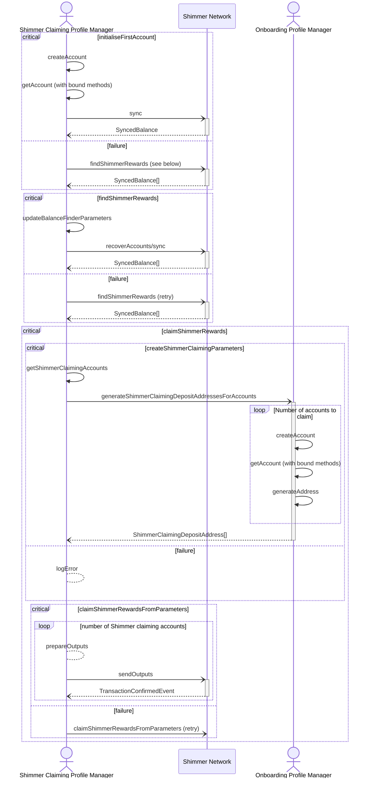

# Shimmer Claiming

Shimmer "claiming" refers to the process of transferring SMR tokens from an address used in an UTXO
within the genesis snapshot to a new address that is derived using the same seed, but with a different
`coin_type` parameter (IOTA = `4218`, Shimmer = `4219`).

## Overview

Throughout the app, we have a `profileManager` object that exposes `wallet.rs` API methods that allow
us to do various things, one of which is creating and managing new accounts. In order to create it, we 
must pass a `coinType` when initializing the object so that it knows how exactly to create accounts and 
generate addresses.

Normally this object is created with `coinType = 4219` (Shimmer), but we need to use a special one
where `coinType = 4218` (IOTA). The reason is so that we can generate the same Ed25519 addresses that 
were ultimately used when the IOTA community staked for Shimmer rewards in November 2021. This special 
object is called the `shimmerClaimingProfileManager`.

## Flowchart

:::caution
This needs to be adjusted to **1)** use output-based logic rather than only syncing and **2)** include lower level account manager functions like `prepareOutputs`, `sendOutputs`, etc.
:::

## Finding Rewards

It is possible that a user has a high number of accounts, addresses, or both, where they staked 
his or her IOTA to receive SMR airdrops. This is due to Firefly V1 using new addresses after previous 
ones were already spent.

Using the `shimmerClaimingProfileManager`, we must generate addresses and query the nodes to determine
regardless of whether funds reside on them. If funds do exist, it means that they have **NOT** yet been claimed from 
their respective genesis output.

## Claiming Rewards

Once funds are found on a particular set of accounts and their addresses, the user can initiate the claiming
process. 

Here, we generate a deposit address (`index = 0`) with the regular `profileManager` object, so that
the funds will reside on a proper Shimmer-based addresses. Taking that address, we send a transaction to it using the
`shimmerClaimingProfileManager` to sign it, effectively "claiming" the funds. This process happens for each account where
funds were found.
