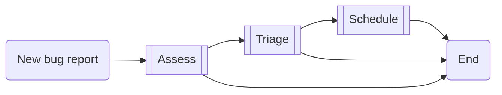
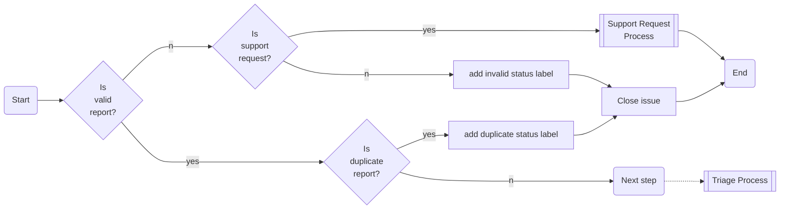
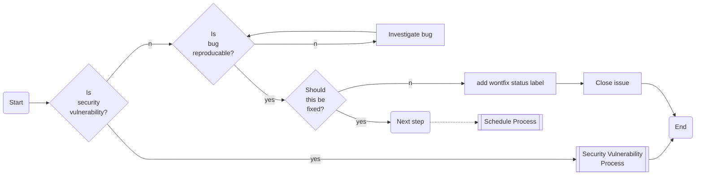
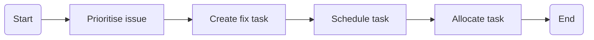

# Issues

## Purpose

This document details the standard operating procedure (SOP) for maintaining issues that have been raised on GitHub; allowing all team members to remain consistent when organising and maintaining the issues backlog.

## Scope

This standard operating procedure is only applicable to maintainers of this repository responsible for the issues backlog; and the issues backlog is that which is found on GitHub only.

## Responsibilities

All members of the core firefly team are responsible for managing issues. If an issue is assigned to you, then it is your responsibility. For those issues without an assignee, we aim to follow a rota to ensure that someone is always responsible for new issues created. You will find an up to date rota below.

### Schedule

* The bug management process is followed by 1 maintainer each week, rotating through all full time maintainers of the Firefly team (in alphabetical order), before cycling back to the begining.

## Processes

* [Bug Management](#bug-management)
* [Support Requests](#support-requests)

## External Processes

* [Security Vulnerability Process](https://github.com/iotaledger/firefly/wiki/SOP:-Security-Vulnerability)

## Bug Management

The bug management process is to be followed when a new issue is raised on GitHub that has the label `bug report` or an existing issue has been given the label `bug report`.

### Overview

The above diagram details the high level overview of the bug management processes:

1. [Assess](#assessment) whether the issue issue is a valid.
2. [Triage](#triaging) the issue.
3. [Schedule](#scheduling) the issue to be fixed.

> **When managing issues please make sure you assign yourself to the issue on GitHub.**

### Assessment

The assessment process is usually followed as soon as an issue is labeled as `bug report` or when we have an existing backlog of bug reports that we need to groom. The assessment process is to ensure that we don't need to triage invalid issues. Please use the below flowchart as a guide to process:

### Triaging

Once an issue has been assessed, we can then triage the issue to decide if we should fix the issue or if we just want to acknowledge the issue because we aren't planning to fix it. This should be done as soon as possible, by following the below process:

### Scheduling

If a bug has been triaged and it is agreed that we should fix the issue, then we need to prioritise the fix and schedule this fix. Again this should be done as soon as possible after triaging, and can be done by following the below process:

## Support Requests

_TBD_
